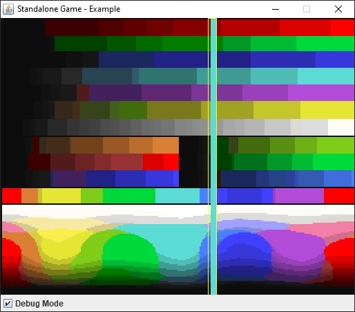

lobby-arcade
============

**Note**: This repository does not contain the proprietary Minecraft implementation.

## Examples

* [tetra](https://github.com/RewisServer/lobby-arcade-tetra)
* [snake](https://github.com/RewisServer/lobby-arcade-snake)
* [invaders](https://github.com/RewisServer/lobby-arcade-invaders)
* [rhythm-hero](https://github.com/RewisServer/lobby-arcade-rhythm-hero)

## Standalone



```java
final ColorTransformer transformer = new MinecraftColorPalette();
final FrameGameCreator creator = () -> new ExampleGame(transformer);
new FrameGameApplication("Example", creator).show();
```

## Licenses

* This project is licensed under [GNU GPL v2](./LICENSE).
* [Sonic](https://github.com/waywardgeek/sonic) audio library by Bill Cox under [Apache 2.0](https://www.apache.org/licenses/LICENSE-2.0).
* Original sound resources are licensed by Mojang.
